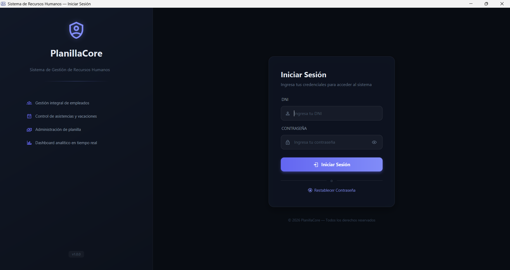
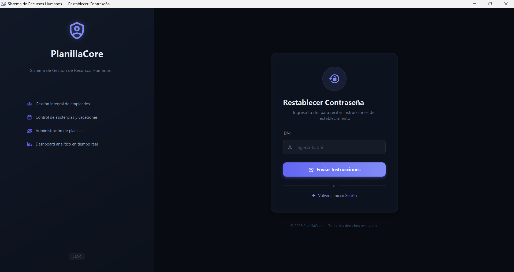

# 📁 Software de Recursos Humanos

## 📌 Descripción

Este proyecto fue desarrollado de manera colaborativa utilizando Git para el control de versiones.
Cada integrante del equipo trabajó en un caso específico dentro del repositorio, organizando el desarrollo mediante ramas y carpetas independientes.

---

## 👥 Integrantes del equipo

* Josseph David Bellido Quispe
  Código: N00452940

* Cristhian Vega Carhuamaca
  Código: N00531783

* Jaqueline Ramirez Lopez
  Codigo: N00531783

* Raydberg Gabriel Chuquival Gil
  Código: N00535385

* Jhon Wilson Rodriguez Quezada
  Código: N00535457

---

## 🛠️ Comandos de Git utilizados

Durante el desarrollo del proyecto se utilizaron los siguientes comandos:

### 🔹 Clonar repositorio

Se utilizó para copiar el repositorio remoto al entorno local:

```bash
https://github.com/JhonRodriguez31/Proyecto_RH.git
```

---

### 🔹 Crear archivo .env

Crear archivo .env o clonar el .env.template y reenombrar a .env

```bash
DB_HOST=
DB_PORT=
DB_NAME=
DB_USER=
DB_PASSWORD=
DB_ENCRYPT=true
DB_TRUST_SERVER_CERTIFICATE=true
BACKEND_URL=
PASSWORD_TEMPORAL=
```

---

### 🔹 Crear ramas

Cada integrante creó su propia rama para trabajar de forma independiente:

```bash
git checkout -b nombre-rama
```

# 🏗️ Arquitectura del Proyecto

El proyecto sigue una arquitectura multi-capa basada en el patrón **MVC (Modelo-Vista-Controlador)**, reforzada con un **Service Locator / Factory** para la gestión centralizada de dependencias e infraestructura moderna en la nube.

## 🧱 Capas del Sistema

1.  **View (Vista):** Archivos `.fxml` que definen la interfaz gráfica y archivos `.css` para los estilos.
2.  **Controller (Controlador):** Clases que gestionan la interacción del usuario, capturan eventos de la vista y delegan la lógica a los servicios.
3.  **Service (Lógica de Negocio):** Capa intermedia donde reside la lógica de la aplicación e integración con APIs externas.
4.  **DAO (Data Access Object):** Capa de persistencia que interactúa con la BD mediante JDBC, utilizando **Vistas** para consultas complejas y **Stored Procedures** para operaciones críticas.
5.  **Model (Modelo):** Entidades y DTOs que heredan de una **clase base auditable**.

---

## ☁️ Infraestructura y Almacenamiento

Para el manejo de archivos multimedia (fotos de empleados), el sistema no almacena archivos binarios en la BD local. En su lugar, utiliza una arquitectura híbrida de alto rendimiento y seguridad:

-   **Cloudflare R2:** Almacenamiento de objetos compatible con S3 para guardar las imágenes de forma distribuida y eficiente.
-   **Supabase Edge Functions:** Se utiliza como capa intermedia de seguridad (Proxy). El cliente Java no se comunica directamente con el storage; en su lugar, invoca una función serverless que valida la petición antes de persistir el archivo en R2.

---

## 🗄️ Persistencia de Datos Avanzada

La base de datos (SQL Server) no solo actúa como un almacén, sino que contiene lógica para mejorar el rendimiento y la integridad:

-   **Vistas (Views):** Utilizadas para desacoplar el modelo de datos complejo y simplificar las consultas desde Java (ej: `vw_PerfilEmpleado`).
-   **Procedimientos Almacenados (SPs):** Operaciones críticas encapsuladas en la BD para garantizar atomicidad y seguridad (ej: `sp_ActualizarPerfilEmpleado`).
-   **Entidad Auditable:** Todas las entidades clave heredan de `EntidadAuditable`, lo que permite un rastreo automático de:
    -   Fecha de creación y actualización.
    -   ID del usuario que realizó la última modificación.

---

## 🏭 Patrón Factory (ServiceFactory)

Para garantizar la **reutilización de instancias** y evitar la creación excesiva de objetos, se implementó la clase `ServiceFactory`. Esta clase actúa como un contenedor de dependencias (Singleton Pattern) que provee instancias únicas de DAOs y Servicios.

### Beneficios:
-   **Desacoplamiento:** Los controladores no saben cómo se instancian los servicios.
-   **Memoria Eficiente:** Solo existe una instancia de cada servicio/DAO durante el ciclo de vida de la aplicación.
-   **Fácil Mantenimiento:** Si se cambia la implementación de un servicio, solo se modifica en el Factory.

### Ejemplo de Uso en Controlador:
```java
public class EmpleadoController {
    // Obtenemos la instancia única desde el Factory
    private final EmpleadoService empleadoService = ServiceFactory.getEmpleadoService();
}
```

---

## 📂 Estructura de Directorios

```text
src/main/java/com/project/
├── common/             # Utilidades, excepciones y enums compartidos
├── config/             # Configuraciones de BD, Env y ServiceFactory 🏭
├── controllers/        # Controladores de la interfaz (MVC) 🎮
├── DAO/                # Interfaces y implementaciones de acceso a datos 🗄️
├── layout/             # Controladores para los layouts base (Admin/User)
├── models/             # Clases de dominio y DTOs 📦
└── services/           # Lógica de negocio (Interfaces e Impl) ⚙️

src/main/resources/com/project/
├── css/                # Hojas de estilo
├── db/                 # Scripts SQL (Schema, Seed)
├── fxml/               # Definiciones de vistas (XML)
├── images/             # Recursos visuales
└── templates/          # Plantillas HTML para reportes
```

---

# 🚀 Recomendaciones de Diseño

## ✅ Buenas Prácticas
-   **Inyección mediante Factory:** Siempre usa `ServiceFactory` para obtener servicios.
-   **Interfaces:** Los servicios y DAOs deben definir interfaces para facilitar pruebas y extensibilidad.
-   **Validación en Services:** Toda validación de reglas de negocio debe ir en la capa de `Service`.

## ❌ Evitar
-   Escribir consultas SQL dentro de los `Controllers`.
-   Lógica de negocio pesada dentro de la `View` o `Controller`.
-   Instanciar DAOs directamente con `new` (usar el Factory).

---

# ⚙️ Configuración y Variables de Entorno

El sistema utiliza variables de entorno para manejar la conexión a la base de datos y otras configuraciones sensibles.

### Estructura de `EnvConfig`:

```java
public class EnvConfig {
    private static final Dotenv dotenv = Dotenv.configure()
            .ignoreIfMalformed()
            .ignoreIfMissing()
            .load();

    public static String get(String key) {
        String systemValue = System.getenv(key);
        if (systemValue != null && !systemValue.isBlank()) {
            return systemValue;
        }
        return dotenv.get(key);
    }
}
```

### Ejemplo de uso:

```java
String host = EnvConfig.get("DB_HOST");
String port = EnvConfig.get("DB_PORT");
String db   = EnvConfig.get("DB_NAME");
```

---

# 🛠️ Tecnologías Utilizadas

- **Lenguaje:** Java 21
- **UI:** JavaFX & FXML
- **Estilos:** CSS3
- **Gestión de dependencias:** Maven
- **Persistencia:** JDBC (SQLServer)
- **Seguridad:** BCrypt para hashing de contraseñas

---

# ✨ Funcionalidades

## Autenticación y Autorización
### Login


### Recuperar Contraseña


---
